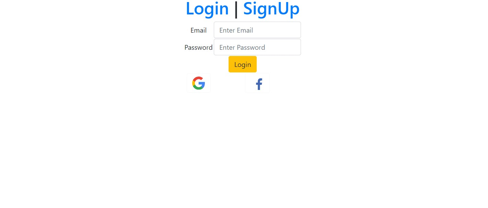
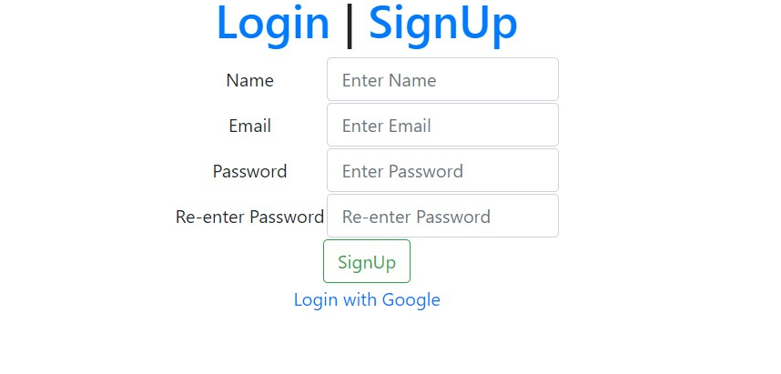
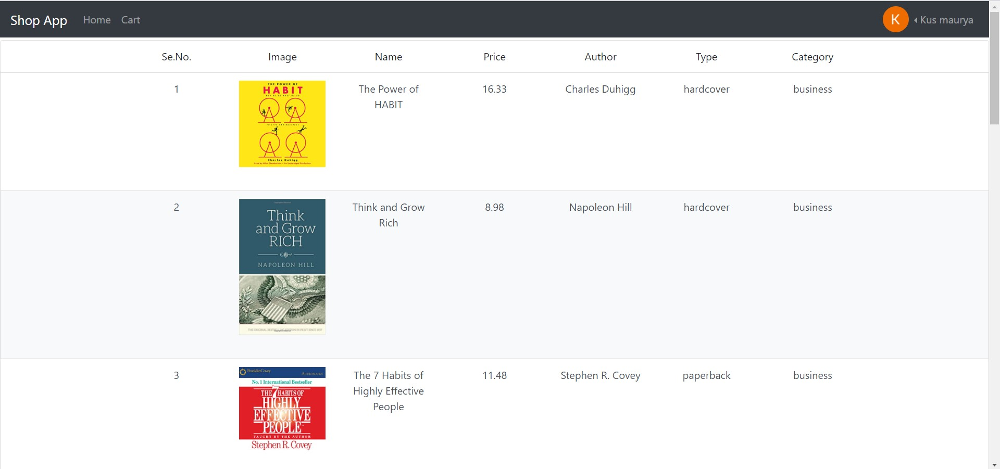
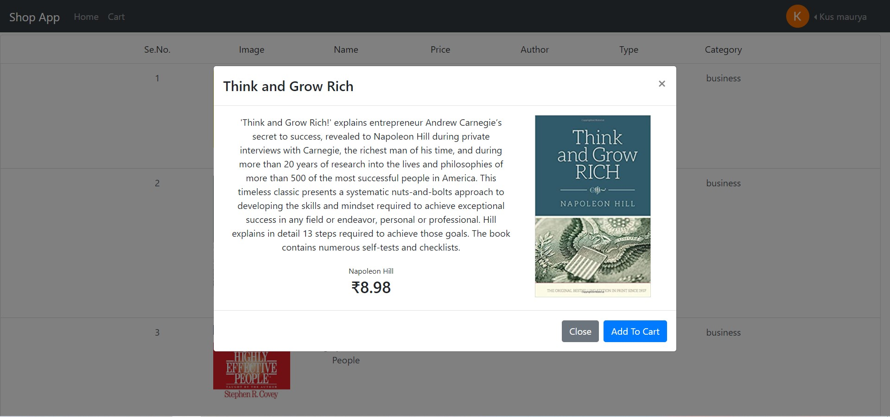
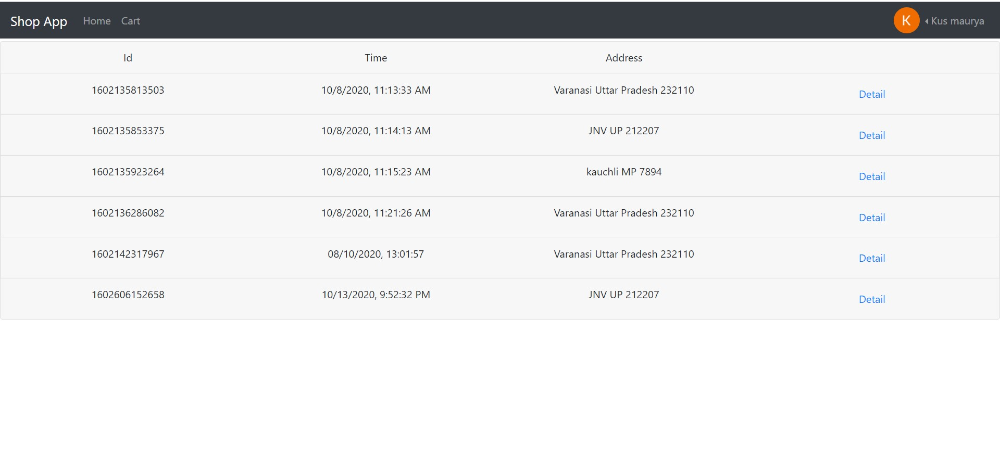
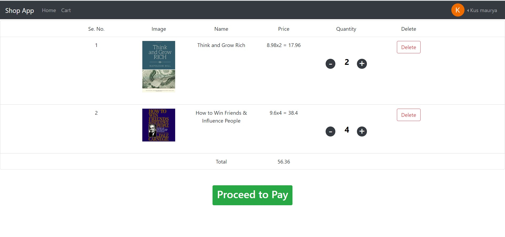
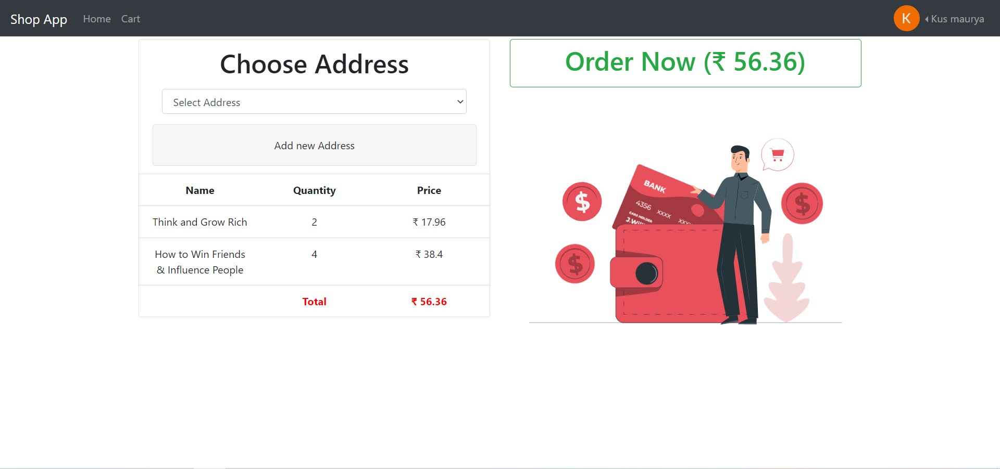

## Demo
[You Tube link for Demo](https://youtu.be/Nc4x1mjNS_Y)

[Screenshots of demo](#screenshots)

# Getting started

> Follow the step to get this project

## 1. Fetching Project

make dir of any name where you want your project and then run this to fetch the data from github

> make sure that path is correct in cmd (use cd)

```
git clone https://github.com/kus0023/React-Firebase-Shop.git

```

## 2. Setup Firebase

[Firebase Console Link](https://firebase.google.com/)

> You need to setup sign methods in authentication and enable Realtime database.
> **_Recommended time (2.33 to 3.20) then (17.43 to 18.05)_** > [Watch this to Setting Things in Firebase](https://youtu.be/PZquB8XdU9k) > **Also enable Google and Facebook if You want to use it as well**

### copy configuration code and paste it into firebase-config/fire.js

[Watch More About Firebase](https://youtu.be/BXHQ5NxU2p8)

## 3. Run Command

`npm install`

> This takes some time wait until its done

## 4. Hurray You Are Ready To Go

hit this command to run the server:
`npm start`

## 5. Last Thing (Important one) (_Dummy Data_)

After login You cannot see any data in Home Page.
So, you need to add that data manually into firebase database.

> I have done this for you just follow this.

Open Extra/index.html
**Put your firebase configuration in Line 17**

Open this file in browser and CLick the button to add products in database.

Enjoy!

# Screenshots








